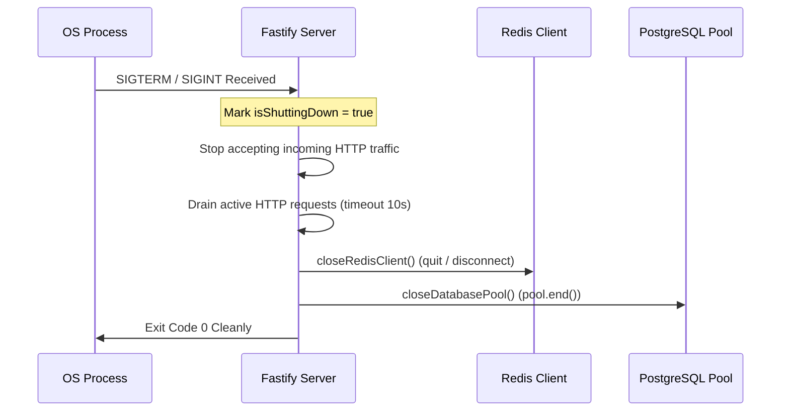

# Lifecycle Separation: Design, Phase, and Runtime Boundaries

Status: `IMPLEMENTED` / `FOUNDATION ONLY`

---

## 1. Phase Separation Matrix

| Component / Domain | Phase 1 (Foundation) | Phase 2 (Core Business) | Phase 3 (Scale & Optimization) |
| :--- | :--- | :--- | :--- |
| **Monorepo Setup** | `IMPLEMENTED` (pnpm Workspaces) | Maintained | Maintained |
| **HTTP Engine** | `IMPLEMENTED` (Fastify Factory) | Business Routes Added | Micro-benchmarked |
| **Security Headers / CORS** | `IMPLEMENTED` (Helmet, Strict CORS) | Policy Hardening | Dynamic Geo-fencing |
| **Database Migrator** | `IMPLEMENTED` (Versioned runner) | Business schema migrations | Read replicas / partition |
| **Provider Contracts** | `IMPLEMENTED` (Abstract Interfaces) | Live Vendor Implementations | Circuit Breakers & Fallbacks |
| **User Authentication** | `FOUNDATION ONLY` (Security Types) | `DEFERRED` (Argon2id + JWT + Sessions) | Multi-Factor Auth (MFA) |
| **Double-Entry Ledger** | `DEFERRED` | `DEFERRED` (ACID Transactions) | Audit automated checks |
| **Order Dispatch** | `DEFERRED` | `DEFERRED` (BullMQ queues) | Real-time SSE streaming |
| **UI Components** | `IMPLEMENTED` (16 WCAG Primitives) | Business Forms & Cards | Advanced Data Visualizations |

---

## 2. Server Runtime Lifecycle

The backend server lifecycle is deterministic and enforces clean shutdown sequences:

